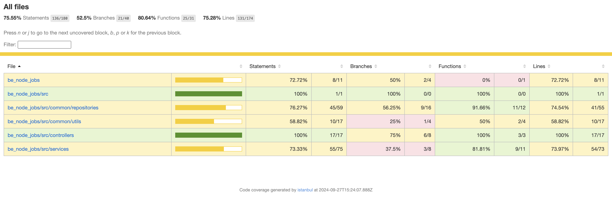
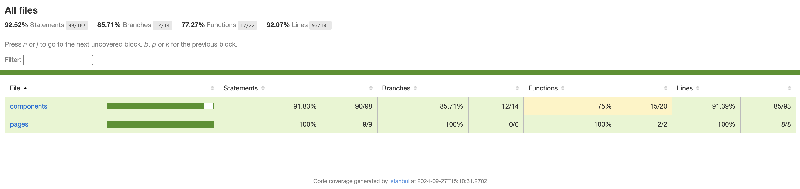
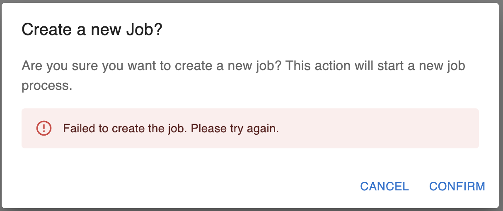
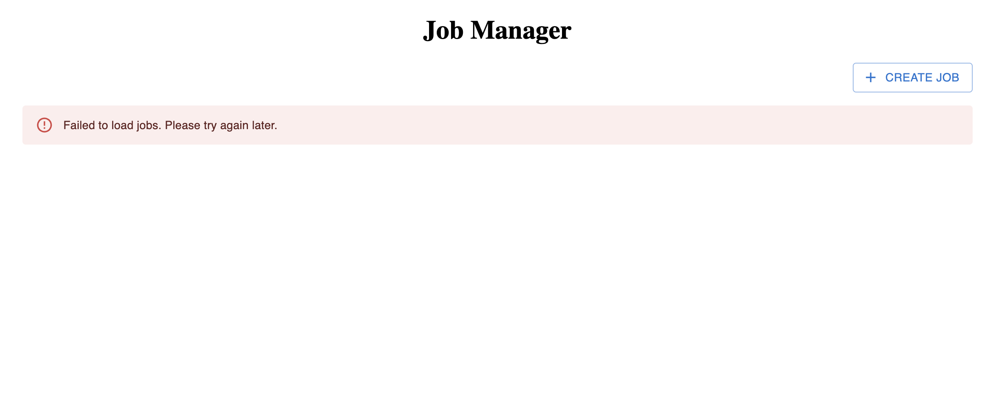

# Job Manager Project

This project allows users to create and manage jobs, utilizing Unsplash API for image fetching. It provides both backend and frontend components along with coverage reports and visual examples.

## 📊 Code Coverage

### Backend Coverage

### Frontend Coverage

## 💻 UI Screenshots

### Error Dialog Example

### Job Manager Error State

## 🎬 Video Demo

Click to view the demo video:

[Job Manager Video](./job-manager-video.mov)

---

Thank you for checking out the project! If you have any questions or need assistance, feel free to reach out to me.
